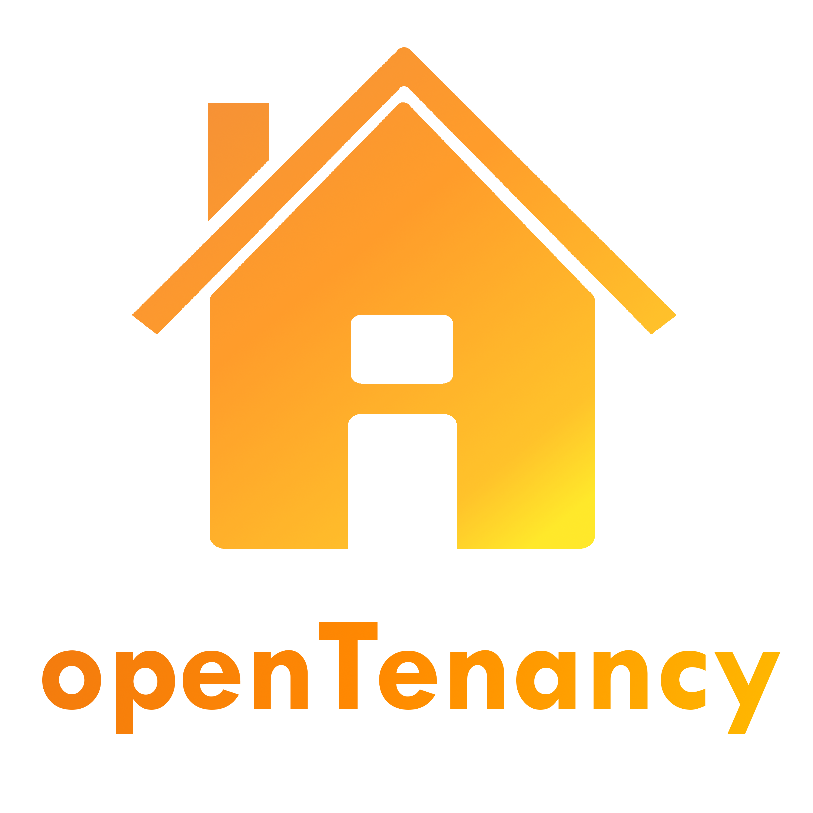
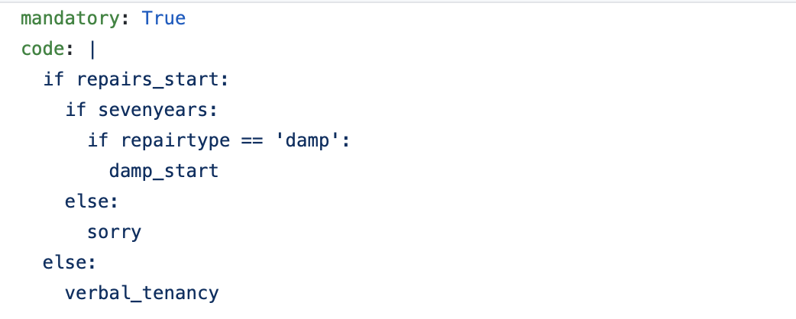

  
# contributing guidelines 
openTenancy is, at its core, open source. We are completely open to contributions, whether that be regarding a typo in our documentation or a whole new path 
or interview. 

### contribution
As it stands right now, your contribution will be checked by our founders - [Amy Conroy](https://github.com/amyconroy) and [Ana Shmyglia](https://github.com/a-shmyg). 
Please outline exactly what you have changed in the body of your pull request, if relevant attach it to an issue, and assign it the relevant tag. 

If we do not accept your pull request, we will give you feedback as to why this has not be accepted, and what needs to change. 

Please note that the contributing guidelines are the same for all parts of openTenancy. If you are submitting for the docassemble side, please be sure to link the 
legal references as well as the relevant topics from the [openTenancy law repo](https://github.com/open-tenancy/opentenancy_law). Please specify whether you have 'completed' that advice template to ensure that no one repeats any work.

### coding style 
1. All interviews branch off of the welcome.yml branch
2. All 'topics' have their own .yml file and can branch off of each other - ie from repairs, branch in to the relevant repairs, and keep branch if necessary
3. General topics will have their own folders - ie repairs, council tax, other
4. The name of these folders should be EXACTLY the same name as the issue 
5. Use branching code, ie: 

continuously through out the code. This where you hit the end of the branch, great a new section of branching code (as above), in to your website. 

- welcome.yml
- /repairs
    - repairs.yml
        - - dampmould.yml
        - - electrics.yml
- /counciltax

## Using Docassemble 

### docker
To contribute to the coding of interviews, you need to run a local version of Docassemble on your machine to run the interview. The easiest way to do so is using Docker.
First install docker and follow the instructions for your operating system. Make sure you have around 20GB of space for both the Docker and the docassemble installation.
The exact instructions on installing docassemble locally using Docker can be found here: https://docassemble.org/docs/docker.html.

### docassemble
Docassemble interview syntax is based on Python. The documentation concerning building the interviews themselves can be found here - https://docassemble.org/docs/interviews.html.
Playground is the docassemble text editor for writing and testing interviews, allowing you to run interviews, and also upload static files such as images embedded on the page or CSS styling files. This is where the interview development takes place.
In general, we have decided to split the logic of each interview from the questions the user answers, as well as generation of the advice document at the end. This means each topic in the interview takes the following structure:

#### DICTIONARY STRUCT
This is currently awaiting implementation. In order for the user to recieve a formatted document at the end of the interview containing all of the questions and their answers, the easiest solution found for this was to set up a variable dictionary structure in the beginning of the interview and fill it out as the user traverses the decision tree. Dictionary keys are the questions, and the values are the user answers, which are then embedded in the outputted document.

#### LOGIC BLOCK
Logic flow of the interview, triggering questions in the correct order and proceeding along the decision tree provided by the opentenancy_law repository. In this way questions can follow logical branches are the user traverses the interview, and at the end reaches the document generation event., and comparison operators or other operations can take place here. Variables are named in camel case, and take care to keep indentation and whitespace clear as possible.

#### QUESTION BLOCK
These are the questions themselves providing fields for the user to input their answers. Due to the way docassemble works, operations can be done within the logic block as the variables in the logic block will only be defined if the question is called. This also means every variable defined in the logic block requires a corresponding question field, or this will lead to an undefined variable error if the branch reaches that variable.

#### DOCUMENT BLOCK
This is the document generation section, outputting a formatted PDF to the user if they request it. Document styling is global across topics, document content is not. Docassemble supports embedded operations, variables, and logic within the document generation. This means you can think of it as a dynamic template where if the user answers a certain question then the corresponding advice will be rendered, and if not then something else will be. 

### Packages
Docassemble interviews are split into packages. Our primary app takes place inside a single package, with multiple YAML files to keep topics modular. The Playground can also be integrated with a GitHub repo, allowing you to push and pull directly from the docassemble server instead of constantly downloading and installing ZIP files on docassemble.

### Workflow
Install and run an instance of docassemble through Docker. Make sure the admin server and login to Playground is functioning. 
Next, download our opentenancy_docassemble repository from GitHub. The base interview is a docassemble package which needs to be installed on your local machine to be able to edit. This can be done through Playground, using the install option. It can also be directly integrated with and pulled from your forked GitHub repo. Once it’s installed, build the provided legal logic tree as an interview, then package again and commit to GitHub. Once you are happy with the state of the interview, submit a pull request so we can add your contribution to our production server.

